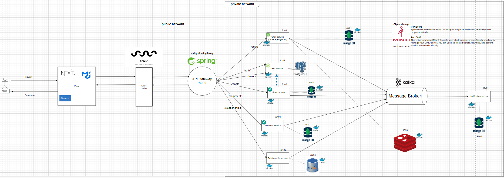

<h1 align="center">Ninstaram Social Media Server</h1>
<p align="center">
  <a href="https://github.com/vihao1802/Social-Media-Client/blob/main/LICENSE">
    
  </a>
  <a href="https://github.com/vihao1802/Social-Media-Client/watchers">
    
  </a>
</p>
<p align="center">
  </a>&nbsp
  </a>&nbsp 
  </a>&nbsp
  <br>
  </a>&nbsp
  </a>&nbsp 
  </a>&nbsp 
    <br>
  </a>&nbsp 
  </a>&nbsp 
  </a>&nbsp 
</p>

> `Social Media Server` built with a microservices architecture to ensure modularity, high performance, and scalability.



#### Source: [Social Media Draw.io (Included ERD)](https://drive.google.com/file/d/1-ma8SlSfstTAvmRTj4ouVahlHMIvyjYE/view?usp=sharing)

## 🎉 Tech Stack

### Frontend
| Technology       | Description                                                                          |
| ---------------- | ------------------------------------------------------------------------------------ |
| **React.js**     | JavaScript library for building dynamic, reusable UI components.                     |
| **Next.js**      | React framework for server-side rendering (SSR) and static site generation (SSG).    |
| **Material UI**  | React component library implementing Google's Material Design for responsive UIs.    |
| **TypeScript**   | JavaScript superset offering static typing for better code quality.                  |
| **Tailwind CSS** | Utility-first CSS framework for rapid and flexible styling.                          |
| **SWR**          | Lightweight library for data fetching, caching, and revalidation in React.           |
| **WebSocket**    | Protocol enabling real-time, two-way communication between client and server.        |
| **Stream.io**    | Platform for building scalable real-time features like feeds, chat, and video calls. |


### Backend
| Technology    | Description                                                                                    |
| ------------- | ---------------------------------------------------------------------------------------------- |
| **Nest.js**   | Progressive Node.js framework for building efficient, scalable backend apps with TypeScript.   |
| **Spring**    | Robust Java-based framework for developing enterprise-grade backend services and APIs.         |
| **FastAPI**   | Modern, high-performance Python framework for building APIs with type hints and async support. |
| **Kafka**     | Distributed event streaming platform for real-time data pipelines and streaming applications.  |
| **Prisma**    | Type-safe ORM for Node.js and TypeScript with auto-generated query builders.                   |
| **Docker**    | Platform for packaging, deploying, and running applications in isolated containers.            |
| **WebSocket** | Protocol enabling real-time, two-way communication between clients and servers.                |
| **Stream.io** | API platform for building scalable real-time features like chat, feeds, and notifications.     |


### Database

| Technology     | Description                                                                                        |
| -------------- | -------------------------------------------------------------------------------------------------- |
| **PostgreSQL** | Open-source relational database system known for reliability, feature robustness, and performance. |
| **MongoDB**    | NoSQL document database designed for scalability and flexibility with JSON-like data structures.   |
| **MinIO**      | High-performance, S3-compatible object storage for building cloud-native data infrastructure.      |


### Architecture and deploy

| Technology                    | Description                                                                         |
| ----------------------------- | ----------------------------------------------------------------------------------- |
| **Microservice Architecture** | Design pattern that separates applications into maintainable and testable services. |
| **EC2**                       | Scalable cloud computing service by AWS for running virtual servers. (For deploying server)                |
| **Vercel**                    | Platform for deploying and hosting modern web applications with ease. (For deploying client)              |

### APIs

- `REST` api are used to handle interactions between the frontend and backend, ensuring scalability and performance.

## 📷 Screenshots

➡️ Let's go to take a look at our project

- Go to this: <a href="https://github.com/vihao1802/Social-Media-Client/blob/main/SCREENSHOTS.md" target="_blank">SCREENSHOTS.md</a>

<!-- GETTING STARTED -->

## 🎯 Getting Started

### 💎 Prerequisites

You should create a `main` directory to wrap 2 repo (client and server) of this system

  Ensure you have the following tools installed:
- [Node.js](https://nodejs.org/en/download) (version 18 or higher)
- [Docker](https://docs.docker.com/desktop/setup/install/windows-install/)

### ⚙️ Installation

#### 🔧 Frontend

1. Clone the repo in the `main` directory

```sh
git clone https://github.com/vihao1802/social-media-client-microservice.git
```

```sh
git clone https://github.com/vihao1802/social-media-server-microservice.git
```

2. Install libraries and dependencies (For client folder):

```
cd social-media-client-microservice
```

```
npm install
```

3. Create file `.env.local` in folder `client`:

```env
NEXT_PUBLIC_BACKEND_URL=http://localhost:8080
NEXT_PUBLIC_WEBSOCKET_URL=ws://localhost:5277/api

NEXT_PUBLIC_STREAM_API_KEY=
STREAM_SECRET_KEY=

CLOUDINARY_CLOUD_NAME=
CLOUDINARY_API_KEY=
CLOUDINARY_API_SECRET=
```

### 🔧 Backend

1. Move to backend folder

```bash
cd social-media-server-microservice
```
2. Setup `.env` file in every service base on `.env.example` file.

2. Build and run all service containers that have been set up in `docker-compose.yml` file with the command

```bash
docker compose up --build -d
```

## 🚀 Usage

### Client ( Run in termnial ):

- From `main` directory

```
cd client
```

- Run `client`

```
npm run dev
```

### Server:

- Run all service all once.

```bash
docker compose up --build -d
```

## ✨ Code Contributors

- This project exists thanks to all the people who contribute.

<a href="https://github.com/vihao1802/Social-Media-Client/graphs/contributors">

</a>

Made with [contrib.rocks](https://contrib.rocks).

## 📝 License

Copyright © 2024 [Tran Vi Hao](https://github.com/vihao1802).<br />
This project is [MIT](https://github.com/vihao1802/Social-Media-Client/blob/main/LICENSE) licensed.

